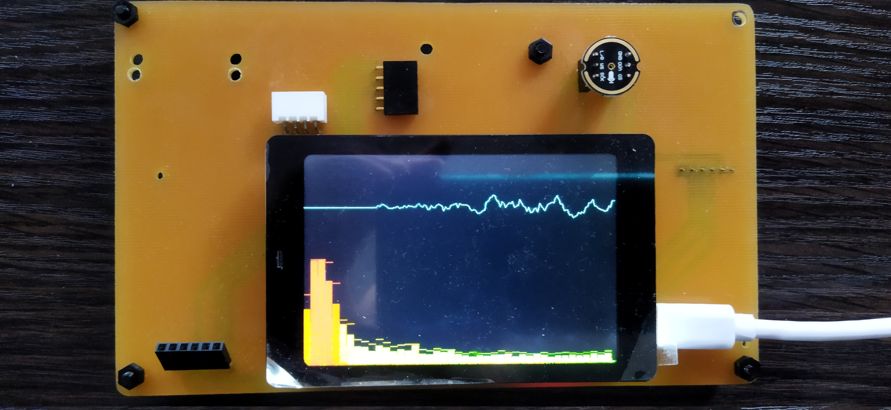
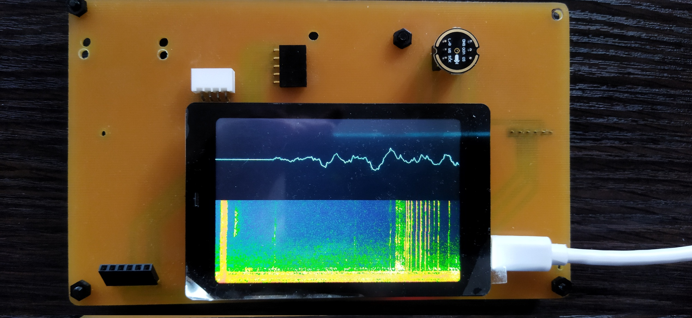
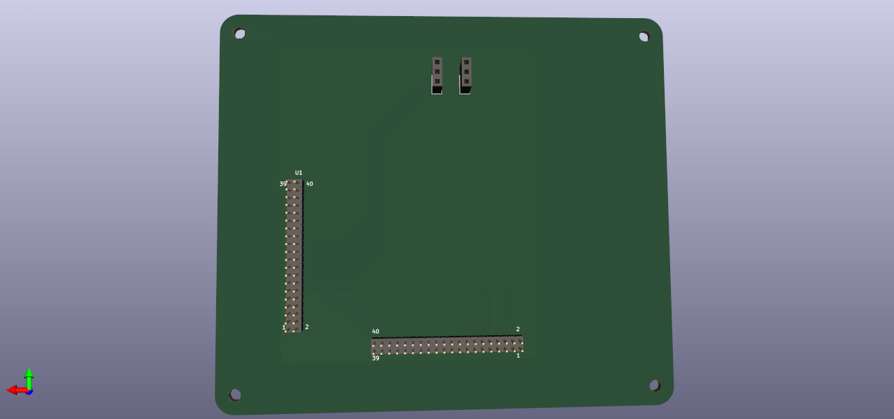

# WT32-SC01 INMP441 Audio Monitor

This is a port of atomic14's TFT audio monitor project to work with the WT32-SC01 board.

## PCB design

[wt32-sc01_kicad](./wt32-sc01_kicad)

As WT32-SC01 pins are 2.0 mm and INMP441 pins are 2.54 mm spaced, it was easier for me to draw the schematics in KiCad v6 and pcb-print it. The Gerber files are there as well.

It's a one layer board. If you feel that you can pcb-print it by yourself, the tools I used were:

* 0.2d V-shape 30' tool for isolation routing: 2 passes with 30% overlap, 0.08 mm deep.
* 0.8d drilling mill for PTH excellon.

## Screenshots

The PCB design files are a simplified version of what you see in the pic below.

<table style="width:100%">
    <tr>
        <td>
            
        </td>
		<td>
            
        </td>
        <td>
            
        </td>
    </tr>
</table>
